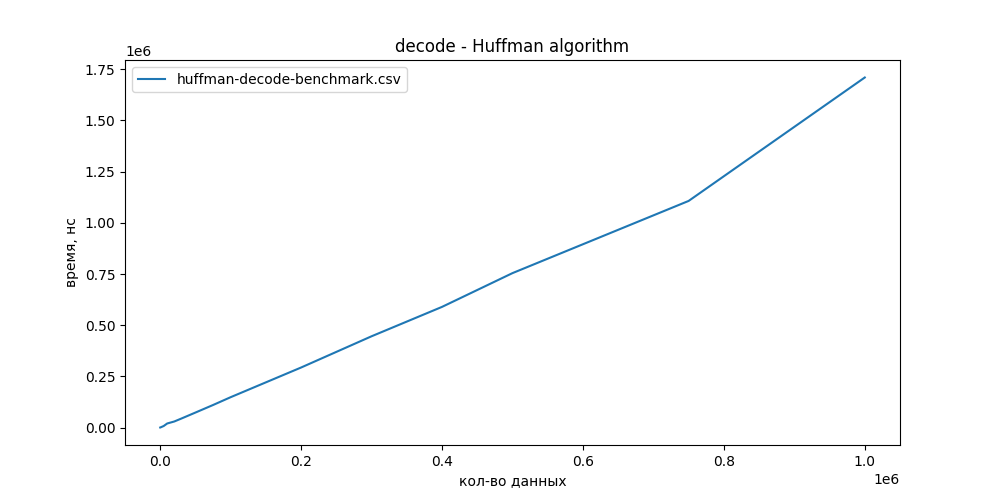

# Кодирование Хаффмана (Huffman encoding)

[](https://github.com/Algorithms-and-Data-Structures-2021/semester-work-huffman-encoding-004/actions/workflows/cmake.yml)

### Описание семестрового проекта:

##### Название структуры данных 

​	Кодирование Хаффмана (Huffman encoding)

##### Что она из себя представляет?

​	Алгоритм Хаффмана — алгоритм оптимального префиксного кодирования алфавита с минимальной избыточностью. Был разработан в 1952 году аспирантом Массачусетского технологического института Дэвидом Хаффманом при написании им курсовой работы. В настоящее время используется во многих программах сжатия данных.

 ##### Где и как она используется?

​	Кодирование Хаффмана широко применяется при сжатии данных, в том числе при сжатии фото- и видеоизображений (JPEG, MPEG), в популярных архиваторах (PKZIP, LZH и др.), в протоколах передачи данных HTTP (Deflate), MNP5 и MNP7 и других.

##### Какова теоретическая сложность операций?

​	*Кодирование* - **O(N*logN)**

​	*Декодирование* - **O(N)**

##### Алгоритм

​	Идея алгоритма состоит в следующем: зная вероятности появления символов в сообщении, можно описать процедуру построения кодов переменной длины, состоящих из целого количества битов. Символам с большей вероятностью ставятся в соответствие более короткие коды. Коды Хаффмана обладают свойством префиксности (то есть ни одно кодовое слово не является префиксом другого), что позволяет однозначно их декодировать.
	​​ Классический алгоритм Хаффмана на входе получает таблицу частот встречаемости символов в сообщении. Далее на основании этой таблицы строится дерево кодирования Хаффмана (Н-дерево).
	​​ Символы входного алфавита образуют список свободных узлов. Каждый лист имеет вес, который может быть равен либо вероятности, либо количеству вхождений символа в сжимаемое сообщение.
	​​ Выбираются два свободных узла дерева с наименьшими весами. 
	​​ Создается их родитель с весом, равным их суммарному весу. 
	​​ Родитель добавляется в список свободных узлов, а два его потомка удаляются из этого списка.
 	​​ Одной дуге, выходящей из родителя, ставится в соответствие бит 1, другой — бит 0. Битовые значения ветвей, исходящих от корня, не зависят от весов потомков. 
	​​ Шаги, начиная со второго, повторяются до тех пор, пока в списке свободных узлов не останется только один свободный узел. Он и будет считаться корнем дерева.

## Команда "whole lotta red"

| Фамилия Имя     | Вклад (%) | Прозвище |
| :-------------- | --------: | -------: |
| Ибрагимов Айдар |        50 |      _x_ |
| Булатов Дмитрий |        50 |      zxc |

**Девиз команды**
> _ puNk mUNk eVRY 1 dESErVES 2 hEAR . KiNG vAMP . BbY <3_

## Структура проекта

_Описание основных частей семестрового проекта._

**Пример**. Проект состоит из следующих частей:

- [`src`](src)/[`include`](include) - реализация структуры данных (исходный код и заголовочные файлы);
- [`benchmark`](benchmark) - контрольные тесты производительности структуры данных (операции добавления, удаления,
  поиска и пр.);
  - [`benchmark/benchmark-visualization`](benchmark/benchmark-visualization) - визуализация результатов контрольных тестов
  - [`benchmark/benchmark-results`](benchmark/benchmark-results)
- [`examples`](examples) - примеры работы со структурой данных;
- [`dataset`](dataset) - наборы данных для запуска контрольных тестов и их генерация;

## Требования (Prerequisites)

_В этом разделе задаются основные требования к программному и аппаратному обеспечению для успешной работы с проектом._

**Пример**. Рекомендуемые требования:

1. С++ компилятор c поддержкой стандарта C++17 (например, _GNU GCC 8.1.x_ и выше).
2. Система автоматизации сборки _CMake_ (версия _3.12.x_ и выше).
3. Интерпретатор _Python_ (версия _3.7.x_ и выше).
4. Рекомендуемый объем оперативной памяти - не менее 4 ГБ.
5. Свободное дисковое пространство объемом ~ 3 ГБ (набор данных для контрольных тестов).

## Сборка и запуск

### Пример (Windows)

#### Сборка проекта

_Опишите процесс сборки проекта._

Склонируйте проект к себе на устройство через [Git for Windows](https://gitforwindows.org/) (либо используйте
возможности IDE):

```shell
git clone https://github.com/Algorithms-and-Data-Structures-2021/semester-work-template.git
```
Создайте виртуальное окружение python:
```shell
python3 -m venv venv
```
Активируйте виртуальное окружение :
```shell
venv\Scripts\activate.bat
```
Загрузите зависимости проекта с помощью пакетного менеджера pip :
```shell
pip install -r requirements.txt
```

Для ручной сборки проекта в терминале введите:

```shell
# переход в папку с проектом
cd C:\Users\username\asd-projects\semester-work-segment-tree-004

# создание папки для файлов сборки (чтобы не засорять папку с проектом) 
mkdir -p build && cd build 

# сборка проекта
cmake .. -DCMAKE_BUILD_TYPE=RelWithDebInfo && cmake --config RelWithDebInfo --build . 
```


### Генерация тестовых данных

Наш алгоритм кодирует набор символов. В качестве тестовых наборов данных мы использовали случайно сгенерированные тексты различной длины. Тексты были получены через API сервиса Randommer.
Для генерации тестовых наборов был написан python скрипт, взаимодействующий с Randommer API и разработана структура конфигурационного json файла для описания текстовых наборов. Таким образом, для генерации тестовых наборов, достаточно декларативно описать их в конфигурационном файле, а скрипт загрузит их с сервиса Randommer и упакует.

Генерация данных:

```shell
# переход в папку генерации набора данных
cd dataset
```

Скрипт генерирует наборы данных описанные в файле [`dataset`](dataset)/[`datasetsConfig.json`](dataset/datasetsConfig.json)

Вы можете использовать **готовую конфигурацию** или написать собственную:

```json
{
  "folder": "data/", 		// название папки для генерации datasetPackages (не изменяйте)
  "fileFormat": "dataset", 	// формат файла набора данных	(не изменяйте)
  "datasetPackages": [ 		// спискок пакетов наборов данных
    {
      "targetFolder": "decode/",		// папка пакета набора данных
      "datasets":[						// список наборов данных
         {
          	"samplesCount": 10000,					// количество данных в наборе
          	"outputFileName": "dataset_of_10000",	// название файла набора данных
          	"numberOfPasses": 100					// количество проходов (информация для бенчмарка)
         },
      ]
	}
  ]
}
```

Запустите скрипт генерации данных:

```shell
python generate_datasets.py
```
```
Тестовые данные представлены в CSV формате (см.
[`dataset/data/dataset-example.csv`](dataset/data/dataset-example.csv)):
```

**Примечание**. Для запуска контрольных тестов, необходимо сгенерировать 4 пакета наборов данных:

```shell
dataset/data/
  buildTree/
    datset_of_500.dataset
    ...
    benchmarkSettings.settings
  getMin/
    datset_of_500.dataset
    ...
    benchmarkSettings.settings
  getSum/
  	datset_of_500.dataset
    ...
    benchmarkSettings.settings
  update/
  	datset_of_500.dataset
    ...
    benchmarkSettings.settings
```


### Контрольные тесты (benchmarks)

**Примечание**. Для запуска контрольных тестов необходимо предварительно сгенерировать или скачать наборы тестовых данных. Наборы данных находятся в папке семестровой работы на [Google Drive](https://drive.google.com/drive/folders/1DPZBLce1NXR2Pm_99Z5Hjxj3v5-zdgJ9?usp=sharing).

##### Список контрольных тестов

| Название                                         | Описание                                | Метрики |
| :----------------------------------------------- | --------------------------------------- | :------ |
| `huffman-encode-benchmark`           | построение H-дерева, кодирование    | _время_ |
| `huffman-decode-benchmark` | декодирование           | _время_ |


В каждом сгенерированном пакете наборов данных лежит файл benchmarkSettings.settings, в котором содержится информация о наборах для контрольных тестов. Поэтому для замера результатов на всех наборах, достаточно просто запустить контрольный тест.

##### Примеры запуска

```shell
./*имя_бенчмарка*
```

Кодирование (найти среднее значение для каждого из наборов данных):

```
./huffman-encode-benchmark
```

Результаты контрольных тестов сохраняются в папке [`benchmark/benchmark-visualization/benchmark-results/`](benchmark/benchmark-visualization/benchmark-results/)


 ### Визуализация результатов контрольных тестов

Создание графиков на основе результатов контрольных тестов

```shell
# переход в папку визуализации результотов контрольных тестов
cd benchmark/benchmark-visualization
```

**Примечание**. Для создания графиков необходимо предварительно получить результаты контрольных тестов в .csv формате

Скрипт создаёт графики на основе json-конфигурации в файле [`benchmark/benchmark-visualization/benchmarkGraphs.json`](benchmark/benchmark-visualization/benchmarkGraphs.json) Вы можете создавать собственные графики, дописывая их в список "benchmarkGraphs":

```json
{
  "benchmarkGraphs": [ // список графов
    {
      "title": "sum of segment(whole segment): segment tree - linear impl", // оглавление графа
      "sources":[ // источники данных для построения графов, список должен содержать один или два источника 
        "linear_getSum_benchmark.csv",
        "segment_tree_sum_getSum_wholeSegment_benchmark.csv"
      ],
      "outputFile": "sum_of_segment_segment_tree_vs_linear_impl(whole segment).png" // имя выходного файла
    }
  ]
}
```

<details>
    <summary>Результат из конфигурации выше </summary>
    
</details>

Создайте графики, описанные в конфигурационном файле

```shell
# запуск скрипта для создания графиков
python create_benchmark_graphs.py
```

Созданные графики будут лежать в папке [`benchmark/benchmark-visualization/benchmark-graphs`](benchmark/benchmark-visualization/benchmark-graphs)

## Источники

_Список использованных при реализации структуры данных источников._

[Huffman Coding | GeeksforGeeks - YouTube](https://www.youtube.com/watch?v=0kNXhFIEd_w)

[Код Хаффмана — Википедия (wikipedia.org)](https://ru.wikipedia.org/wiki/%D0%9A%D0%BE%D0%B4_%D0%A5%D0%B0%D1%84%D1%84%D0%BC%D0%B0%D0%BD%D0%B0#:~:text=%D0%90%D0%BB%D0%B3%D0%BE%D1%80%D0%B8%D1%82%D0%BC%20%D0%A5%D0%B0%D1%84%D1%84%D0%BC%D0%B0%D0%BD%D0%B0%20%E2%80%94%20%D0%B0%D0%BB%D0%B3%D0%BE%D1%80%D0%B8%D1%82%D0%BC%20%D0%BE%D0%BF%D1%82%D0%B8%D0%BC%D0%B0%D0%BB%D1%8C%D0%BD%D0%BE%D0%B3%D0%BE%20%D0%BF%D1%80%D0%B5%D1%84%D0%B8%D0%BA%D1%81%D0%BD%D0%BE%D0%B3%D0%BE,%D0%B2%D0%BE%20%D0%BC%D0%BD%D0%BE%D0%B3%D0%B8%D1%85%20%D0%BF%D1%80%D0%BE%D0%B3%D1%80%D0%B0%D0%BC%D0%BC%D0%B0%D1%85%20%D1%81%D0%B6%D0%B0%D1%82%D0%B8%D1%8F%20%D0%B4%D0%B0%D0%BD%D0%BD%D1%8B%D1%85.)

[Алгоритм Хаффмана — Викиконспекты (ifmo.ru)](https://neerc.ifmo.ru/wiki/index.php?title=%D0%90%D0%BB%D0%B3%D0%BE%D1%80%D0%B8%D1%82%D0%BC_%D0%A5%D0%B0%D1%84%D1%84%D0%BC%D0%B0%D0%BD%D0%B0)

[Алгоритм Хаффмана, Построение кодового дерева Хаффмана - ТЕОРИЯ ИНФОРМАЦИИ (studme.org)](https://studme.org/187066/informatika/algoritm_haffmana)

_**Это не плагиат, это уважение чужого труда и помощь своим сокурсникам более подробно разобраться в теме.**_
